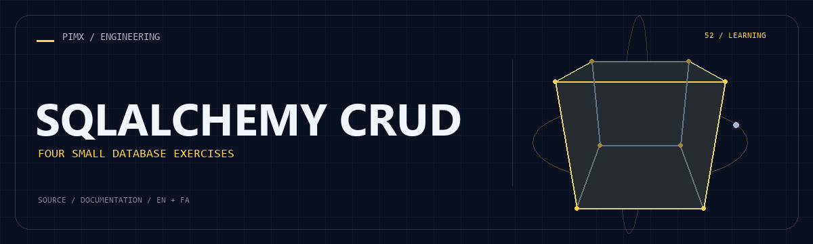

<div align="center">



**[English](README.md) · [فارسی](README.fa.md)**

</div>

# 🗄️ SQLALCHEMY CRUD

Four Python ORM exercises demonstrate insertion, selection, update and deletion against a MySQL table.

[GitHub](https://github.com/MOHAMMADREZAABEDINPOOR/sqlalchemy) · [PIMX / Profile](https://github.com/MOHAMMADREZAABEDINPOOR) · [Static artwork](assets/readme/hero.png)

| At a glance | Details |
|:---|:---|
| 🗄️ Experience | Learning exercise / source archive |
| 🧰 Built with | `Python` |
| 🌐 Documentation | [English](README.md) · [فارسی](README.fa.md) |

[✨ Features](#features) · [🚀 Getting started](#getting-started) · [⚙️ Configuration](#configuration) · [🌍 Deployment](#deployment)

---

<a id="features"></a>

## ✨ Features

| Area | Included capability |
|:---|:---|
| ⚡ Workflow | Mapped pr1 table |
| ⚡ Workflow | Insert/select/update/delete scripts |
| ⚡ Workflow | Session-based ORM operations |

<a id="stack"></a>

## 🧰 Stack

| Tool | Version / source |
|---|---|
| Python | `standard library / source imports` |

<a id="getting-started"></a>

## 🚀 Getting started

Python 3; a desktop/Tk installation for Tkinter or turtle examples. Tkinter is provided by the Python installation, not pip. Legacy dependencies may need a compatible Python version.

```bash
git clone https://github.com/MOHAMMADREZAABEDINPOOR/sqlalchemy.git
cd sqlalchemy

python -m pip install "SQLAlchemy<2" mysql-connector-python
python "sql insert.py"
python "sql1 select.py"
```

<a id="configuration"></a>

## ⚙️ Configuration

No standard environment template is defined. Standalone exercises need no external configuration; inspect any service constants or paths in the source before running.

<a id="usage"></a>

## 🎯 Usage

Create a disposable MySQL database, replace the development connection strings in all scripts, then explore insert/select before update/delete.

<a id="project-structure"></a>

## 🗂️ Project structure

| Path | Role |
|---|---|
| [`assets/`](assets/) | Brand/media/README assets |
| [`sql insert.py`](sql%20insert.py) | Project entry/configuration file |
| [`sql1 select.py`](sql1%20select.py) | Project entry/configuration file |
| [`sql2 update.py`](sql2%20update.py) | Project entry/configuration file |
| [`sql3 delete.py`](sql3%20delete.py) | Project entry/configuration file |

<a id="commands-and-checks"></a>

## 🧪 Commands and checks

No automated test command is declared in a manifest. Verify behavior through a local example run.

<a id="deployment"></a>

## 🌍 Deployment

This is a local learning exercise, not a public service. Browser exercises can use static hosting.

<a id="limitations"></a>

## 📌 Limitations

Connection strings are hardcoded in the historical source. Update/delete expect matching rows and can fail if absent. Use a disposable database.

<a id="troubleshooting"></a>

## 🛠️ Troubleshooting

- Connection failure: configure a running disposable MySQL database and replace the source connection strings.
- Update/delete failure: create the expected row before running those examples.

<a id="contributing"></a>

## 🤝 Contributing

Create a focused branch, verify the affected behavior and explain the change clearly. Keep private data, build outputs and local databases out of commits.

<a id="license"></a>

## 📄 License

No repository-level license file is included in this snapshot. Public visibility alone does not grant reuse rights; contact the repository owner for terms.

---

Part of **PIMX** · Documentation in English and Persian.

---

<div align="center">

🗄️ **SQLALCHEMY CRUD** · [English](README.md) · [فارسی](README.fa.md)

</div>
